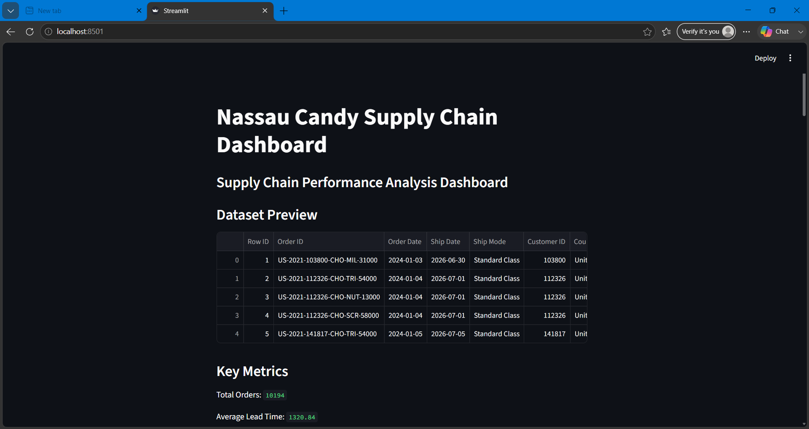
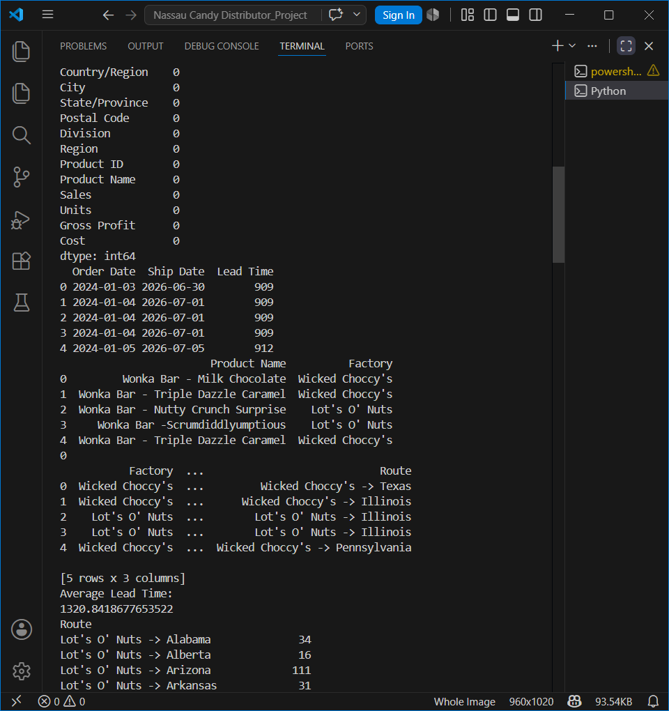
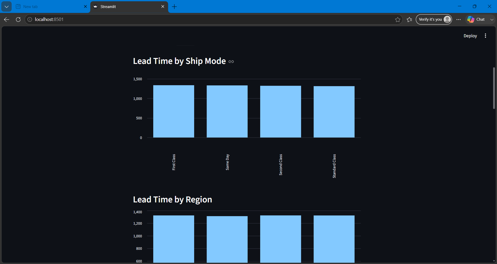
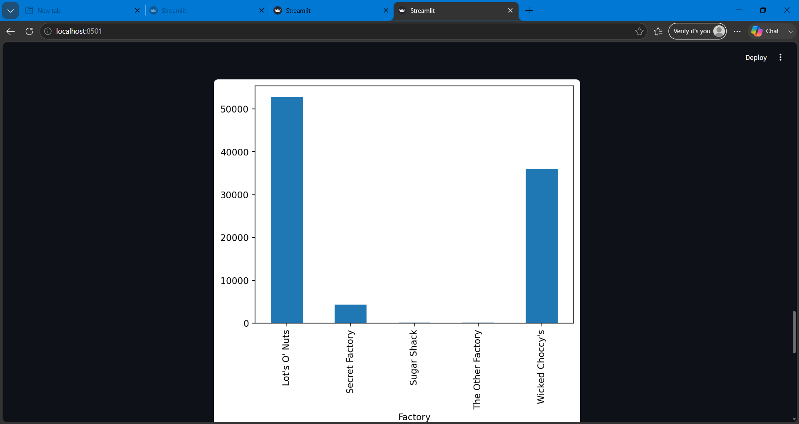

# Factory-to-Customer Shipping Route Efficiency Analysis for Nassau Candy Distributor

## Project Overview

This project analyzes the efficiency of factory-to-customer shipping routes for Nassau Candy Distributor. The goal is to identify efficient and inefficient routes, evaluate shipping performance across regions, analyze shipping modes, and detect geographic bottlenecks affecting delivery operations.

## Problem Statement

Nassau Candy Distributor operates across multiple regions in the United States. The organization lacks route-level visibility into shipping performance, making logistics optimization difficult. This project provides data-driven insights to improve delivery efficiency and support better logistics decisions.

## Objectives

* Calculate Shipping Lead Time for all orders
* Analyze route efficiency across regions and states
* Identify high-delay and low-delay routes
* Compare shipping performance by Ship Mode
* Detect geographic bottlenecks
* Build an interactive Streamlit dashboard

## Dataset Information

The dataset contains:

* Order Details
* Customer Information
* Shipping Information
* Geographic Data
* Product Details
* Sales and Profit Data

Key fields include:

* Order Date
* Ship Date
* Ship Mode
* Region
* State/Province
* Product Name
* Sales
* Gross Profit

## Technologies Used

* Python
* Pandas
* NumPy
* Matplotlib
* Seaborn
* Streamlit

## Key Performance Indicators (KPIs)

* Shipping Lead Time
* Average Lead Time
* Route Volume
* Delay Frequency
* Route Efficiency Score

## Dashboard Features

* Dataset Preview
* Key Metrics Overview
* Lead Time by Ship Mode
* Lead Time by Region
* Orders by Factory
* Delay Analysis
* Top States by Lead Time
* Sales by Region
* Profit by Factory
* Top Products Analysis

## Dashboard Screenshots

### Dashboard Home


### Lead Time Analysis


### Sales by Region


### Profit by Factory


## Project Structure

```text
Nassau_Project/
│
├── data/
├── visuals/
├── reports/
├── dashboard.py
├── processed_supply_chain.csv
└── README.md
```

## Business Impact

This project helps identify operational bottlenecks, improve shipping efficiency, reduce delivery delays, and support data-driven logistics decision-making.

## Future Enhancements

* Interactive geographic maps
* Route efficiency scoring model
* Predictive delay analysis
* Advanced logistics optimization dashboard

## Author

Pranali Khapne

Computer Science Engineering Student
